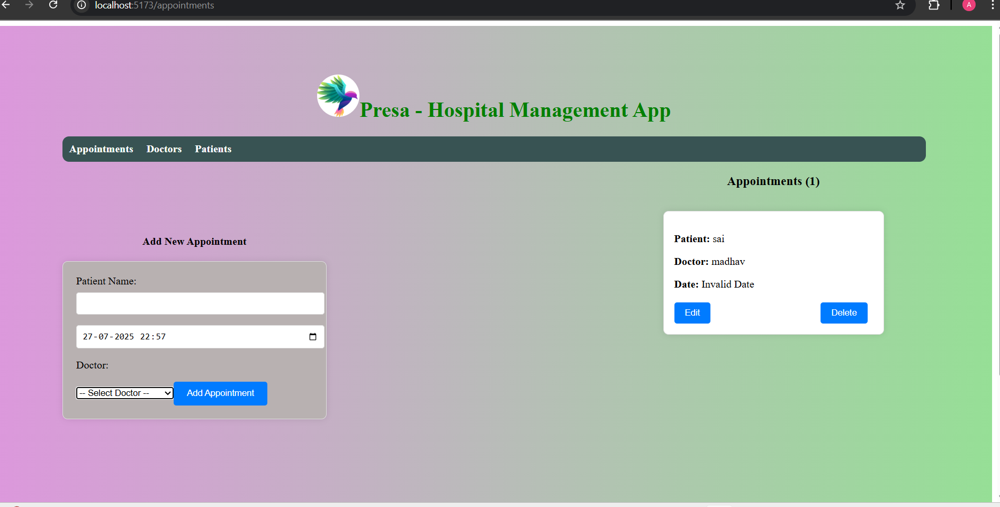
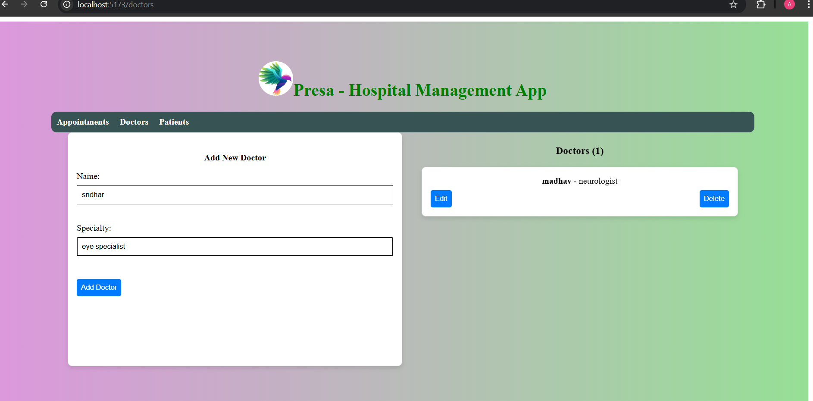

# 🏥 Hospital Management App

A simple and functional hospital management system built with the **MERN stack**. It allows hospital staff to manage:

- 🧑‍⚕️ Doctors
- 🧍 Patients
- 📅 Appointments (with real-time doctor availability check)

This application is suitable for educational/demo purposes and provides a clean UI with core CRUD functionality.

---

## 📸 Screenshots

### 📅 Appointments

### 🩺 Doctors

### 👤 Patients

> Screenshots are placed in the `screenshots/` directory inside your project.

---

## ⚙️ Features

- ➕ Add, ✏️ Edit, 🗑️ Delete **Doctors**, **Patients**, and **Appointments**
- ⏱️ Appointments check for doctor availability at a specific datetime
- 🧾 Simple UI using card layout and minimal forms
- 🔍 Real-time updates without page reload

---

## 🛠️ Tech Stack

| Layer      | Tech                             |
|------------|----------------------------------|
| Frontend   | React, Axios, CSS                |
| Backend    | Node.js, Express.js              |
| Database   | MongoDB                          |

---
